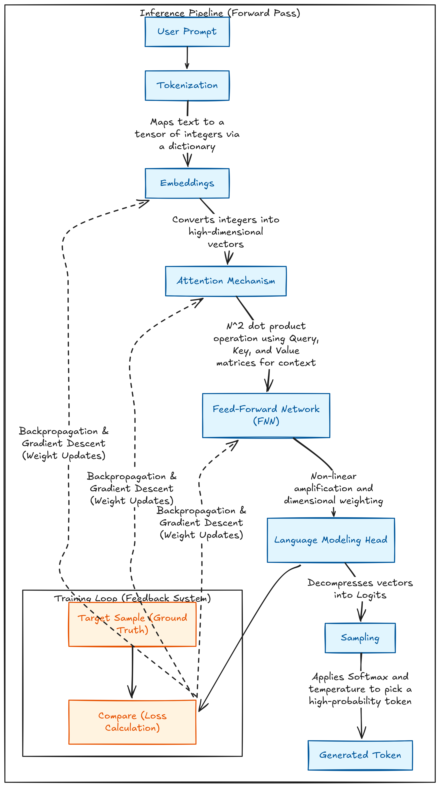
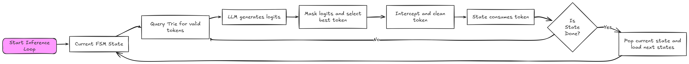
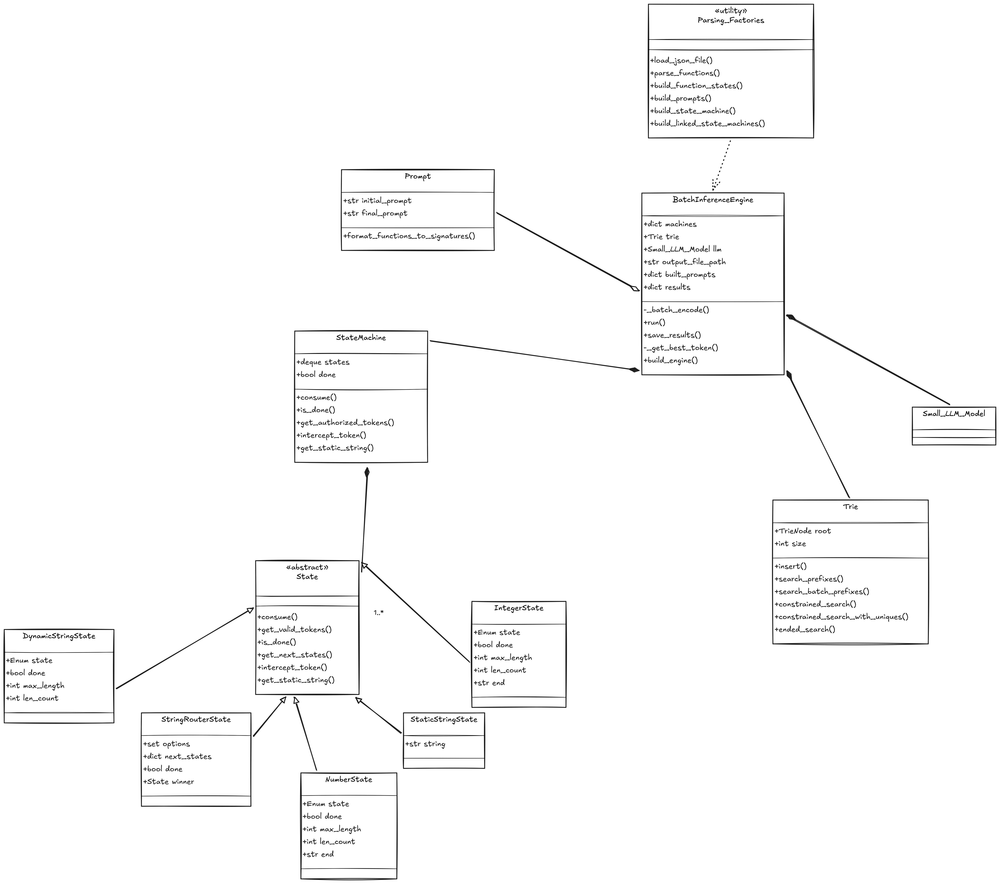

*This project has been created as part of the 42 curriculum by abounoua.*

# 📞 Call me Maybe: Constrained Decoding for LLMs

## Description
Large Language Models (LLMs) are inherently stochastic, meaning they predict the next token based on probabilities, which makes them unreliable for generating strict, machine-readable formats like JSON. **Call me Maybe** is a custom inference engine designed to force Small Language Models (like Qwen-0.6B) to generate perfectly formatted function calls based on predefined JSON schemas.

By implementing **Constrained Decoding**, this project removes the LLM's ability to hallucinate invalid syntax or incorrect data types, ensuring a 100% reliable JSON output ready for API consumption. This project is our first brick for agentic AI pipelines interacting with the real world.

In this README we will dive into the world of FSMs (Finite State Machine), LLMs (Large Language Model) and inference optimization.


*Screenshot of the Streamlit visualizer in action.*

---

## Instructions

### Prerequisites
- Python 3.10 or higher
- [uv](https://docs.astral.sh/uv/) (Python package manager)
- `make` utility

### Installation
Clone the repository and use the provided Makefile to install all necessary dependencies via `uv`:
```bash
git clone <your-repository-url>
cd call-me-maybe

# Install dependencies and setup the virtual environment
make install
```

### Execution

The project can be run using the Makefile for the default configuration or using uv for argument parsing.

#### Standard Batch Inference:
Runs the engine using the default input and definition files.
```bash
make run
```

#### Custom Batch Inference:
You can override the default paths by passing variables to the entry point:
```bash
uv run python -m src
--functions_definition data/input/functions_definition.json
--input data/input/function_calling_tests.json
--output data/output/function_calls.json
```

#### Interactive Streamlit Visualizer (Bonus)
```bash
uv run -m streamlit run src/ui.py
```

#### Development & Linting
To ensure strict type safety and code quality (as required by the 42 curriculum):
```bash
make lint         # Standard mandatory checks
make lint-strict  # Strict mypy checks
make clean        # Clean caches and virtual environment
```

#### Example Usage

The engine takes a JSON array of natural language prompts and outputs a JSON array of parsed function calls based on the provided schemas.

**Input (`data/input.json`):**
```json
[
{"prompt": "Can you add 42 and 58 for me?"},
{"prompt": "Calculate the square root of 64"}
]
```

**Function Definitions (`data/functions_definitions.json`):**
```json
[
{
"name": "fn_add_numbers",
"description": "Adds two numbers together.",
"parameters": {
    "a": {"type": "integer"},
    "b": {"type": "integer"}
},
"returns": {"type": "integer"}
}
]
```

**Output (`data/output/function_calling_results.json`):**
```json
[
{
"prompt": "Can you add 42 and 58 for me?",
"name": "fn_add_numbers",
"parameters": {
    "a": 42,
    "b": 58
}
}
]
```
---

## Attention is all you need
To easily understand the next parts, we need to introduce LLMs. Transformer-based Large Language Models were created in 2017. The goal of this part is to explain the fundamentals and the different steps of text generation. Let's keep it simple but precise.

A LLM is a predictive model whose purpose is to generate a set of probabilities distributed across its large dictionary. It is based on a "prompt," which is a system/user input that introduces a set of words to the LLM, asking it to predict the next word based on its training. We will skip normalization steps to keep it simple. To easily understand it, let's break it down:


*Detailed steps of the inference process: from tokenization to sampling, including the attention mechanism.*

### Inference
#### Tokenization: 
A tensor (multi-dimensional set of numbers) is created to store integers. These integers are mapped to a trained dictionary containing the most common words or sub-words seen during training. An LLM doesn't understand text; it understands numbers.

#### Embeddings: 

Each token in the tensor is associated with a high-dimensional vector representing the word in its most basic sense. We can understand this by thinking of a dimension as encoded information—for example, a dimension assessing how "feminine" a word is.

#### Attention: 

Each embedding is compared to every other embedding in an N2 operation. By multiplying the embedding by a lower-dimensional matrix named a Query, it is projected into a specific "characteristic request." This request encodes what the token is looking for (subject, verb, etc.). It is then compared via a dot product with a Key matrix, which represents the characteristics of other tokens. This dot product creates a score that weights a Value matrix (the actual content), which finally makes the initial embedding richer. Attention is divided into multiple parallelized heads that focus on a small set of characteristics.

#### FNN (Feed-Forward Network): 

Now that the embeddings are context-rich, we pass them into a standard trained neural network. This non-linear function-based network amplifies each characteristic of the initial embedding by projecting it into a larger dimensional vector. It then compresses the data back to a vector of the same size, which is added to the initial embedding to provide a logical weight to each dimension.

#### Language Modeling Head:

A final neural network layer that "decompresses" the vector information, distributing it across every word in the dictionary. The output of this matrix operation is called logits. We then apply a Softmax function to assign a 0 to 1 probability to each word.

#### Sampling: 

To keep the output natural and dynamic, an LLM doesn't always select the best token. It applies a sampling method to select a high-probability token—based, for example, on a temperature weight—to select a semi-random token from the top of the probability distribution.

### Training

As you can see, an LLM is basically just a big function with billions of parameters, which are only matrices. Anyone can code these fundamentals using PyTorch or any Python machine learning library. What makes the difference between models is the training. The training process is the crux of AI. The goal is to fetch, clean, and prepare datasets for optimal training. Before training, every weight is set to purely random data. Training is the operation of ingesting the data into the LLM, calculating the logit sample, comparing it to the target sample, and updating every weight using gradient descent and the backpropagation algorithm to make the calculus more precise.

Now that you have the fundamentals of the generation process, we can introduce constrained decoding.

---

## What is a FSM ?

We talked a little bit about FSMs, but maybe you ask yourself what it is? A FSM (Finite State Machine) is a category of state machines. Wow, it doesn't help a lot. Let's understand first what a state machine is.

In the world, a lot of things can be represented as a set of precise states, transitioning from one to another. This is exactly a state machine. The traffic light in your street is only a transitioning color state: green, yellow, red, green, yellow, red... This is what we call automata theory. Multiple categories of state machines exist: 

- **DFA (Deterministic Finite Automaton):** A machine where each state has exactly one transition for each possible input. It is the most rigid and predictable model: for a given state and input, there is only one possible next state.

- **NFA (Non-Deterministic Finite Automaton):** A machine where a state can have multiple transitions (or none) for the same input. While more flexible in design, they are often converted into DFAs for actual computation.

- **PDA (Pushdown Automaton):** A state machine equipped with a stack (memory). This allows the machine to "remember" previous symbols, which is essential for validating nested structures like parentheses, HTML tags, or JSON braces.

- **Mealy Machine:** A state machine where the output depends on both the current state and the current input. It reacts immediately to changes in the input stream.

- **Moore Machine:** A state machine where the output depends only on the current state. The output only changes once a transition to a new state is fully completed.

- **Turing Machine**: The most powerful model. It consists of a state machine and an infinite tape it can read from and write to. It is the theoretical basis for modern computers and can simulate any algorithm.

Now that you have a deep understanding of each model, let's see what we used in our case!

---

## Algorithm Explanation

### Introduction to Constrained Decoding

Constrained decoding is a technique that aims to enhance LLM outputs to respect precise constraints. This technique is used especially for small models (fewer parameters) which can be easily distracted. The goal of constrained decoding in function calling, for example, is to take advantage of an LLM's capabilities to understand human language and transcribe it into a reliable API call. It is the door to agentic models and maybe the future of AI.

However, constrained decoding is not an easy task. In the case of JSON, such as in this project, the algorithm has to handle multiple data types, JSON structuring, and a set of schemas.

To ensure a high level of reliability, the idea is to process the generated logits to mask those that invalidate the generation schema. Let's dive into the implementation.


### Implementation

The project's algorithm is based on the complementarity of the following entities: 

1. **The Trie (Vocabulary Tree):** At initialization, the LLM's entire tokenizer vocabulary is loaded into a Trie data structure. This allows for lightning-fast prefix and character-level searches.
2. **Finite State Machines (FSM):** The provided JSON schema is parsed into a linked FSM. The machine knows exactly what characters are legally allowed at any given step (e.g., opening a bracket, writing a key, parsing an integer).
3. **Logit Masking (The Intersection):** During generation, the FSM queries the Trie to get a `set` of authorized token IDs. We then fetch the probability distribution (`logits`) from the LLM. We filter these logits, keeping only the ones authorized by our FSM, and select the highest-scoring valid token.

The goal of this project was also to create a great decoding architecture, ensuring that the engine can be used for multiple models with different input/output schemas. It also aimed to make the generation process extremely fast, optimizing each query and each byte. This project was run exclusively on a CPU, so there was no choice :)


*Logical flow of the inference loop and authorized token management via the FSM.*

#### The Trie (Vocabulary Tree)

The goal of constrained decoding is to stop the generation process at each step in order to compute authorized tokens. To do this computation, we have to select tokens that respect our schema. Depending on the state (which we will introduce later), we can perform a constrained search (all tokens containing only specific characters), a prefix search (all tokens prefixing a given string), or other derivations of these.

One of the best data structures for these searches is a prefix tree. A prefix tree, also called a Trie, is a searching data structure based on character splitting. It basically stores every word character by character, making a branch at each point for each next character. It allows for O(n) string/prefix searching with lighter calculations than a hash map (only pointer manipulation). However, it is poorly optimized for memory because it stores every single character in a node.

Therefore, the Trie will be the golden path to our token dictionary during the generation process. We instantiate it by decoding each token and pushing its children, character by character, from the vocabulary file. We can then implement different searching functions.

#### The FSM(s)

The foundation of our algorithm is the State Machine. For the main State Machine, we use a deterministic finite state machine. Here is where it begins to be fun: each state of our main machine is actually a state machine too! More precisely, they are Moore FSMs because, for each state, they are able to return a list of authorized tokens based on our Trie.

We use the following different states: 

- **Static String State:** A basic Moore FSM where each state represents a specific character of a fixed string. It enforces the generation of mandatory syntax (e.g., `{"name": ` or `, "parameters": {`) by only authorizing the token that completes the sequence.

- **Router State:** Acts as a deterministic decision point. It provides a list of valid function names as static strings. Once the LLM selects a specific function name, the FSM transitions to the unique corresponding `StaticStringState` for that function's parameters. It has the superpower to generate future states to inject into the main FSM (for example, for function parameters).

- **String State:** Manages the generation of arbitrary text within double quotes. It authorizes any token except the unescaped closing quote `"` until the internal logic (or a specific schema constraint) allows the termination of the string.

- **Integer State:** A specialized state that restricts generation to numerical digits `[0-9]`. It handles optional signs (like `-`) and prevents the selection of tokens containing non-numeric characters (like `.` or `e`) to ensure the output remains a valid integer.

- **Number State:** Similar to the Integer State but more permissive, allowing for floating-point syntax. It tracks the presence of a decimal point or an exponent, maintaining valid number formatting throughout the process.

Each state can be derived to represent a piece of the JSON schema. They are well organized into the main state machine to ensure a proper and well-formatted output.

#### Logit Masking (The Intersection)

The inference process is basically a pipeline based on the parent FSM. The path is simple: getting allowed tokens at the current state, generating logits, and picking a token.

To execute this, we call an FSM method that passes the data along the state tree to the current state, asking it what token can follow the result. Then, it generates the logits using the LLM and picks the best token from the authorized list.

The goal is to ensure polymorphism between each state to make the code as fluid as possible. We will talk about that now.

---

## Design Decisions

Building a Constrained Decoding engine is not just an algorithmic challenge; it is a software engineering one. Managing FSM transitions, Trie traversals, and logit masking within a single continuous loop can quickly degenerate into unmaintainable spaghetti code. 

To prevent this, a strong emphasis was placed on creating a robust, modular, and scalable Object-Oriented architecture. The following design decisions outline how we bridged the gap between complex automata theory and clean code principles, ensuring the engine is as elegant under the hood as the JSON it produces.


*Class diagram detailing the orchestration, the Trie, and the State logic.*

- **State polymorphism:** The FSM is broken down into highly specialized states (`IntegerState`, `StringState`, `RouterState`, `StaticStringState`). This allows the engine to easily adapt, add, or remove states. The goal is to have a single interface for each state, with methods like `consume()` and `get_valid_tokens()`, and also smart state functions that can interact with the generated token or optimize performance.
- **Extensive use of dependency injection and factories**: The goal of this project was to be as polymorphic as possible. To ensure this, each dependency is injected into its parent. Used in cooperation with multiple factories, it guarantees highly reusable code and clean dependency switching. For example, we can easily change the generation model, the parsing utilities, or the different states.
- **SOLID, SoC, Adapters**: To ensure code quality and core OOP concepts, a lot of patterns were used. The goal was to follow the "Make It Work, Make It Right, Make It Fast" mantra, ensuring that the patterns are only used to solve real problems.
- **Pydantic Validation:** Used heavily for parsing the input definitions and validating the final output structures, ensuring that the engine fails fast if the input definitions are malformed.
- **Visual FSM Debugger:** Implemented a Streamlit UI that uses a Python generator (`yield`) to step through the token generation in real-time. This visualizes the allowed tokens at each step, proving the constrained decoding works at the token level.

---

## Performance Analysis

In the realm of Large Language Models, performance is typically a delicate balancing act between generation speed and output accuracy. This project introduces a severe hardware constraint: achieving 100% reliable constrained decoding while running exclusively on CPU computations. 

The following analysis breaks down the architectural optimizations that allowed the engine to maintain strict JSON compliance without suffering from crippling inference latency.

### Accuracy & Reliability:

The engine achieves 100% JSON syntax compliance. Because the LLM is physically prevented from selecting invalid tokens, the reliability is strictly bounded by the FSM's logic, not the model's intelligence.

It is also compatible with models other than Qwen/Qwen3-0.6B, such as stabilityai/stablelm-3b-4e1t or Mistral small models.

The project also uses advanced prompt engineering enveloped into a `Prompt` class. Indeed, it properly formats the prompt using a strong system context and documentation quoted markers (`<|im_end|>`, `<|tool_call|>`, etc.). It also uses the advanced prefill concept with the tool call marker to enhance output precision.

### **Speed:** 

The project was realized with CPU-only computations, no GPU. This means that Torch calculations were extremely slow during every LLM generation step. That naturally forced the project to be as efficient as possible while ensuring perfect reliability.

#### Data Structures

The Trie implementation allows constraint filtering to happen in $O(L)$ time (where $L$ is the token length). The overhead added to the standard inference loop is minimal, keeping generation times highly competitive.

A Python double-ended queue (`collections.deque`) is also used for the best state queue performance.

#### Context
As we saw in the LLM introduction, the attention mechanisms run in $O(N^2)$ where N is the number of words in the LLM context. This means that the attention process has an extremely rapid growth depending on the prompt and generation context size. With this information, my goal was to make the system prompt as small as possible. To achieve this, I reformatted function definitions to be in the pythonic format `func(arg1: type, arg2: type)`. I also refined the system prompt to be straightforward.

#### Generation Process

To make the program faster, I tried to use the tokenization processor as little as possible in order to never recompute pre-tokenized content. For example, the program stores the decoded results throughout the process and updates it in order to skip a potential big last decode. I used NumPy for its C optimization for big authorized set sampling. Finally, I made sure that single authorized or static string states don't launch the logit processing. With these optimizations, the engine can handle approximately 1 prompt every 4 seconds on CPU.

---

## Challenges Faced

This project can be a real trap if it is not built following strong OOP patterns and proper state machine handling. A lot of simpler ways were possible and would have taken less time, but the goal was also to learn strong programming patterns and reach an advanced AI understanding. That's why I spent more than a week just reading whitepapers and documentation about the attention mechanism, the LLM generation process, and automata theory. 42 projects are not company projects; the goal is not to ship a POC, but to achieve a strong engineering level, not just assembling tools.


1. **The "Float vs. Integer" Logit War:**
   * *Issue:* When a prompt contained a decimal (e.g., `-10.5`) but the function schema required an `integer`, larger models strongly favored tokens containing a decimal point `.`.
   * *Solution:* I had to harden the `IntegerState` Trie search. Because tokenizers sometimes group characters (e.g., `"10."` as a single token), simply checking the Trie path wasn't enough. I implemented a full string decode check within the Trie search to strictly isolate and ban multi-character tokens containing invalid symbols.

2. **The Multi-Character Token Trap (Token Interception):**
   * *Issue:* LLMs heavily favor aggregated tokens like `",` or `}}` over individual characters like `"` or `}`. Masking logits to *only* allow single termination characters forced the LLM down unnatural, low-probability paths, often causing infinite loops.
   * *Solution:* I implemented an `intercept_token` mechanism. Instead of strictly forbidding compound tokens, the FSM allows them if they contain the unescaped termination character. I then intercept the generated token, mark the state as done, clean the string, and re-encode it (acting as a lightweight "Token Healing" process).

3. **Invalid Sequence Escapes (The Double-Dot Problem):**
   * *Issue:* A basic constrained search allowed characters that were valid *in isolation* to be repeated illegally (e.g., allowing multiple decimal points to generate IP-like strings like `192.16.15` instead of standard floats).
   * *Solution:* I implemented strict uniqueness tracking during the Trie traversal using `frozenset` for immutability, ensuring characters like `.` can only be validated exactly once per number generation.

4. **SDK Limitations on Batching & Performance Bottlenecks:**
   * *Issue:* The provided `llm_sdk` did not support batched token encoding or batched logit generation. Calling the logit generation character-by-character for every single state was a massive performance bottleneck.
   * *Solution/Impact:* While I couldn't bypass the SDK's lack of tensor batching, I drastically optimized the FSM pipeline. I bypassed logit generation entirely whenever the FSM dictated a `StaticStringState` or when the Trie only returned a single authorized token, directly consuming it and saving countless costly SDK calls.

5. **OOP Architecture & State Management:**
   * *Issue:* Managing FSM transitions, Trie interactions, and logit masking within a single loop quickly threatened to become unmaintainable spaghetti code.
   * *Solution:* I invested heavily in advanced Object-Oriented Programming (OOP) patterns. By decoupling the `BatchInferenceEngine` from the polymorphic `State` classes, each state is now strictly responsible for its own token validation and transition logic.

6. **Pipeline Resilience & Error Handling:**
   * *Issue:* A single FSM failure (e.g., an infinite loop on a weird token combination) would crash the entire batch inference process.
   * *Solution:* I established strict error boundaries. I implemented max-token limits on individual states to violently break infinite loops. Raw technical exceptions are caught at the FSM level and bubbled up as domain-specific `StateException`s, allowing the engine to log the error, gracefully skip the failing prompt, and safely process the rest of the batch.

---

## Testing Strategy

A constrained decoding engine is only as reliable as its underlying logic. If a single state allows an illegal character, the LLM's stochastic nature will inevitably exploit it, breaking the JSON structure. To guarantee the promised 100% reliability, testing could not be an afterthought. It required a rigorous, multi-layered approach to ensure the FSM remains unbreakable, even when the model attempts to generate adversarial tokens.

- **FSM Unit Testing:** Each individual state (e.g., `IntegerState`) was tested against edge cases (negative numbers, zeroes, missing end quotes for strings).
- **Type Safety (`make lint-strict`):** The entire codebase passes `mypy --strict` and `flake8`, ensuring zero implicit `Any` returns and rock-solid internal data pipelines.
- **Adversarial Prompts:** Tested the engine with prompts designed to trick the LLM into generating unescaped quotes or invalid data types to verify the FSM never breaks character.
- **Comprehensive Test File:** One strong and complete test file was created to test every data type in order to ensure that no error was possible.
- **Integration Testing:** A dedicated shell script is available to run functional tests for each data type (int, float, string, bool) in sequence:
```bash
  cd tests
  chmod +x run_tests.sh
  ./run_tests.sh
```
---

## Resources

- **Constrained Decoding & FSM Theory:**
    - [LMSYS Blog: Compressed FSM](https://www.lmsys.org/blog/2024-02-05-compressed-fsm/) — Insights on optimizing Finite State Machines for LLM guidance.
    - [Inria: Cours sur les Automates](https://gallium.inria.fr/~maranget/X/421/poly/automate.html) — Theoretical foundation for state machines and formal languages.
    - [JSON Standard](https://www.json.org/json-en.html) — Official specification for the JSON format structure.
    - Inspired by libraries like [Outlines](https://github.com/outlines-dev/outlines) and [Guidance](https://github.com/guidance-ai/guidance).

- **LLM Architecture & Tokenization:**
    - [Attention Is All You Need](https://arxiv.org/abs/1706.03762) — The foundational paper introducing the Transformer architecture.
    - [3Blue1Brown: Neural Networks & Transformers](https://www.3blue1brown.com/topics/neural-networks) — Excellent visual explanations of neural network inner workings.
    - [Tiktokenizer (Qwen)](https://tiktokenizer.vercel.app/?model=Qwen%2FQwen2.5-72B) — Interactive tool for visualizing how text is split into tokens by the Qwen tokenizer.
    - [Qwen Documentation: Core Concepts](https://qwen.readthedocs.io/en/latest/getting_started/concepts.html) — Understanding the architecture and inference logic of the Qwen model family.
    - [GPT-2 Source Code (OpenAI)](https://github.com/openai/gpt-2/tree/master/src) — Reference for early BPE (Byte Pair Encoding) and tokenizer implementations.
    - [Hugging Face Documentation](https://huggingface.co/docs) — Comprehensive guides on the open-source machine learning ecosystem.

- **Software Engineering & Architecture:**
    - [Refactoring.Guru](https://refactoring.guru/) — Invaluable resource for Object-Oriented Programming (OOP) design patterns and clean code principles.
    - [Pydantic Documentation](https://pydantic.dev/docs/validation/latest/get-started/) — Reference for the data validation framework used to secure the I/O pipeline.
    - [Hermes Function Calling](https://github.com/NousResearch/Hermes-Function-Calling#prompt-format-for-function-calling) — Reference for structuring function calling prompts and schemas.

- **UI Framework:** [Streamlit](https://streamlit.io/) for the live inference visualizer.

- **AI Usage:** - *Gemini Pro* was used to aggregate web information, explain complex concepts and redact the documentation. AI was also utilized to draft the boilerplate layout for the Streamlit UI, allowing more time to focus on integrating the `yield` based inference stream.